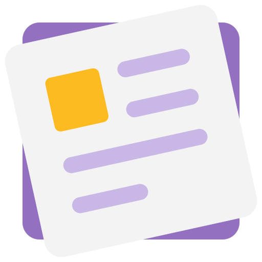
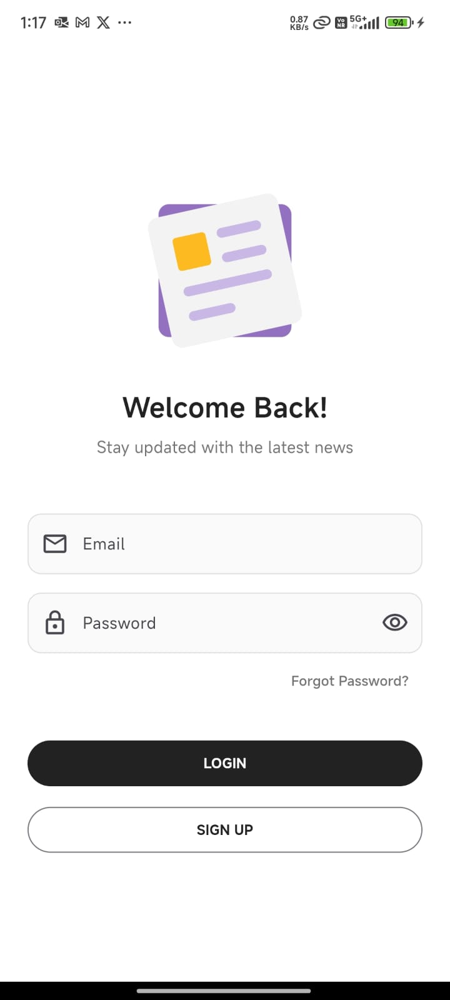
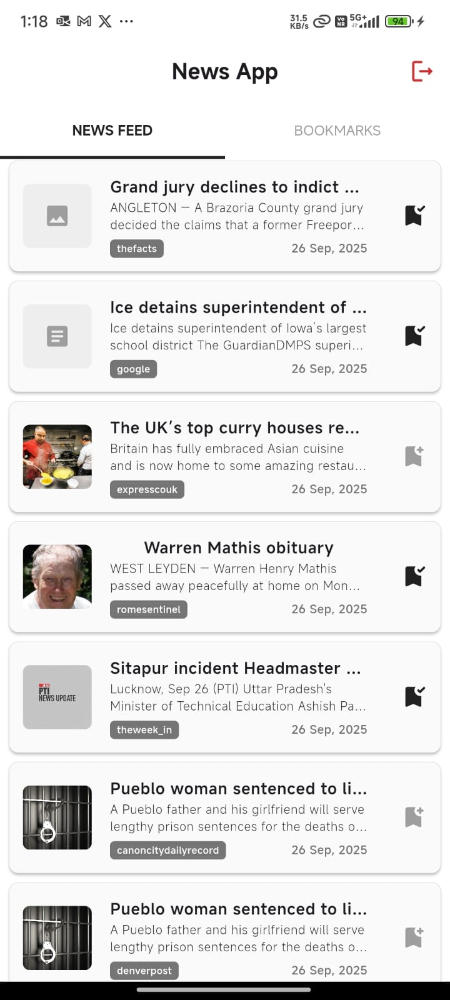
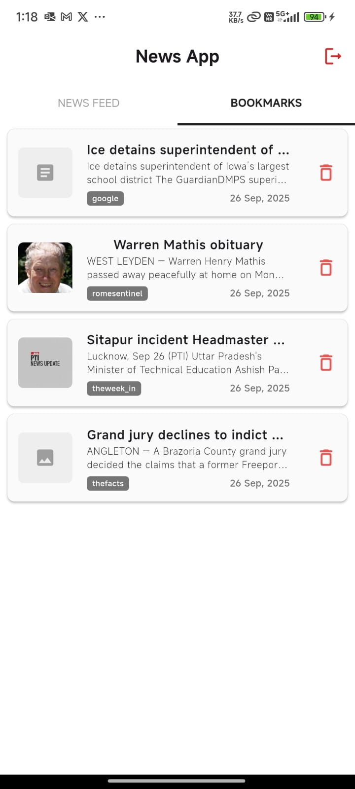
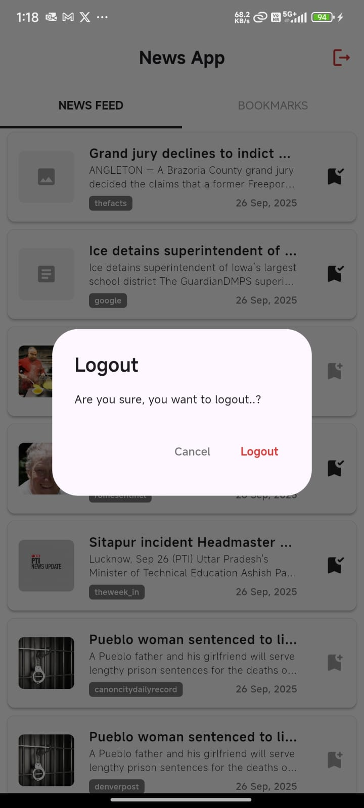

# 📰 Flutter News App

<p align="center">
  
</p>

A modern **News App built with Flutter** that fetches articles from [NewsData.io](https://newsdata.io/) API.  
The app includes **login, bookmarking, persistent sessions, and clean navigation** using GetX and Shared Preferences.

---

## 🚀 Features

- **Authentication**

  - Simple login screen with email & password fields.
  - Login session persistence using `shared_preferences`.

- **News Feed**

  - Fetches live news using `newsdata.io` API.
  - Displays each article with **Thumbnail Image, Title, Description, Source Name, and Published Date**.
  - On tap → opens full article in a **WebView**.

- **Bookmarks**

  - Save any article for later reading.
  - Persistent storage of bookmarks (data survives app restart).
  - Delete button to remove bookmarks easily.
  - Once bookmarked, the icon changes to avoid duplicate saves.

- **Navigation**
  - Tab-based navigation (`News Feed` | `Bookmarks`).
  - Logout option with confirmation dialog.

---

## 📱 Screenshots

<p align="center">
  
  
  
  
</p>

---

## 📦 Packages Used

| Package                                                                  | Usage                                              |
| ------------------------------------------------------------------------ | -------------------------------------------------- |
| [get](https://pub.dev/packages/get)                                      | State management, navigation, dependency injection |
| [http](https://pub.dev/packages/http)                                    | REST API calls to `newsdata.io`                    |
| [shared_preferences](https://pub.dev/packages/shared_preferences)        | Save login session & bookmarks locally             |
| [webview_flutter](https://pub.dev/packages/webview_flutter)              | Open full news article in embedded WebView         |
| [intl](https://pub.dev/packages/intl)                                    | Date formatting                                    |
| [flutter launcher icon](https://pub.dev/packages/flutter_launcher_icons) | Changing App Logo for Android and iOS              |

---

## 🏗️ Project Architecture

The app follows a **clean MVC structure with GetX for state management**:

```
    lib/
    ├── components/        # Reusable Widgets/Screens
    ├── constants/         # API keys, Base urls and app constants
    ├── controllers/       # GetX Controllers (All controllers and logics)
    ├── models/            # Data models (NewsModel)
    ├── views/             # UI Screens (All the Screens)
    └── main.dart          # Entry point
```

---

## ⚙️ Setup Instructions

Follow these steps to run the project locally:

1. **Clone the repository**
   ```
   git clone https://github.com/imaditya-31/news_app.git
   cd news_app
   ```
2. **Install dependencies**
   ```
   flutter pub get
   ```
3. **Configure API Key**

   - Go to [NewsData.io](https://newsdata.io/) and sign up for a free API key.
   - Add your API key inside the project `(constants/api_constant.dart)`.

   ```
   const String apiKey = "YOUR_API_KEY_HERE";
   ```

4. **Run the app**
   ```
   flutter run
   ```
5. **Release build instructions (if someone wants APK/IPA)**
   ```
    flutter build apk --release
    flutter build ios --release
   ```

## 👨‍💻 Developer

**Made with ❤️ by Aditya Vishwakarma**

---

## 🔗 License

This project is open-source and available for learning and improvement.
